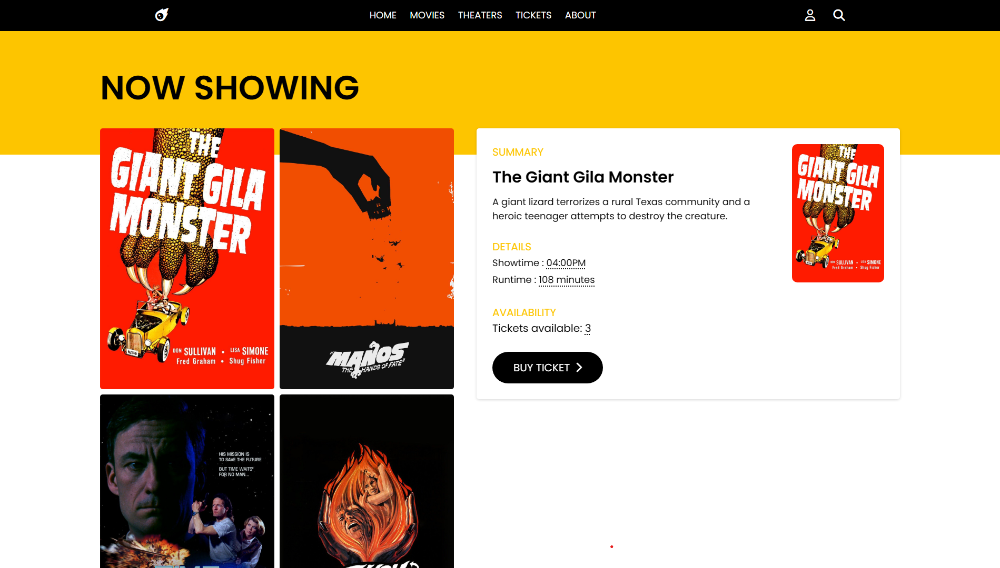
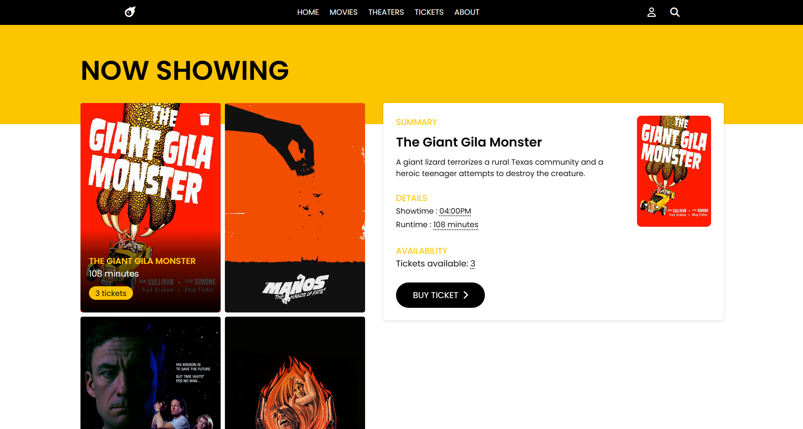
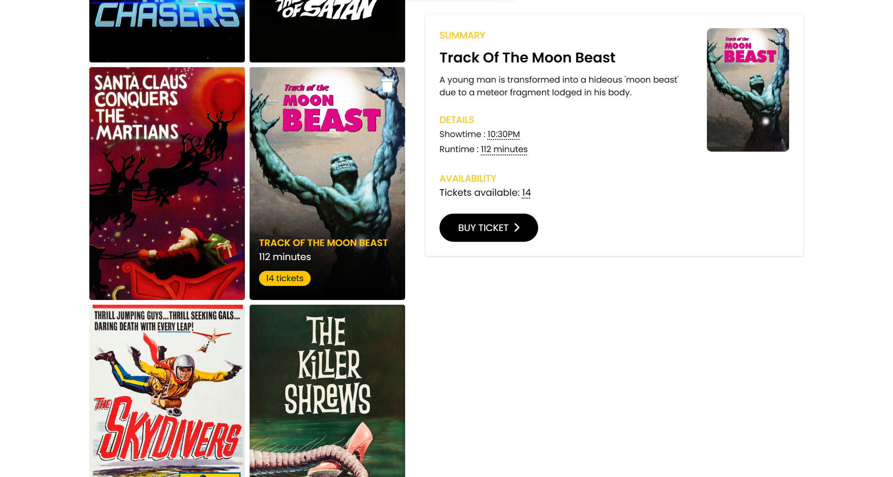

# PHASE 1 - WEEK 3: CODE CHALLENGE

# Flatdango - Movie Ticket App

An application that allows a user to purchase movie tickets from the theater

The app can:
- Show first movie's details i.e., poster, title, runtime, showtime, and available tickets
- Show a menu of all movies on the left side of the page when the page loads
- Buy a ticket for a movie when button is clicked
- Replace the currently displayed movie's details with the new clicked movie's details
- Indicate that the movie is sold out by changing the button text to "Sold Out"
- Indicate that the movie is sold out on a list's film item
- Persist the updated number of `tickets_sold` on the server
- Delete a film from the server using the delete button on each film in the menu

# Installation

Recommend local installation as the app requires locally running 'json-server' to work, the website appears broken if you use the deployment link.

# Setup
- Visual Studio Code, see [here](https://code.visualstudio.com/)
- Windows Subsystem for Linux (WSL), details [here](https://learn.microsoft.com/en-us/windows/wsl/install)
- Local deployment and GitHub pages [deployment](https://eugenemrg.github.io/phase-1-wk2-code-challenge/)
- json-server via [npm](https://www.npmjs.com/package/json-server)

# Languages
- JavaScript
- HTML
- CSS
- JSON

# Screenshots

Show first movie's details i.e., poster, title, runtime, showtime, and available tickets

Show a menu of all movies on the left side of the page when the page loads

Replace the currently displayed movie's details with the new clicked movie's details

# Author
[eugenemrg](https://github.com/eugenemrg) 

# License
Project licensed under GNUv3. See [license](/LICENSE)

Flatdango. An application that allows a user to purchase movie tickets from the theater.

Copyright (C) 2023 [eugenemrg](https://github.com/eugenemrg) 

    This program is free software: you can redistribute it and/or modify
    it under the terms of the GNU General Public License as published by
    the Free Software Foundation, either version 3 of the License, or
    (at your option) any later version.

    This program is distributed in the hope that it will be useful,
    but WITHOUT ANY WARRANTY; without even the implied warranty of
    MERCHANTABILITY or FITNESS FOR A PARTICULAR PURPOSE.  See the
    GNU General Public License for more details.

    You should have received a copy of the GNU General Public License
    along with this program.  If not, see https://www.gnu.org/licenses/